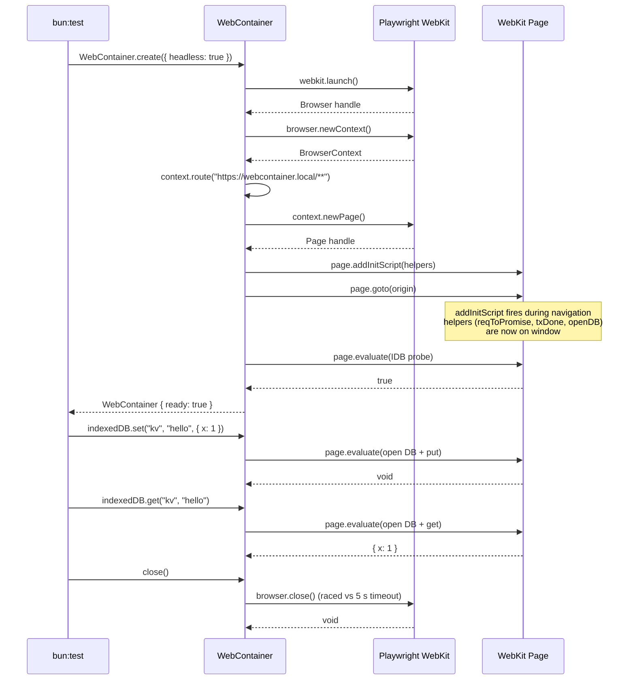
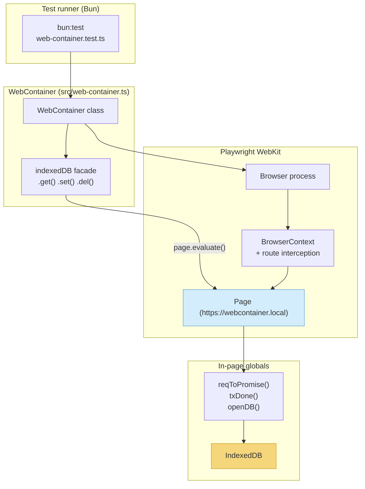
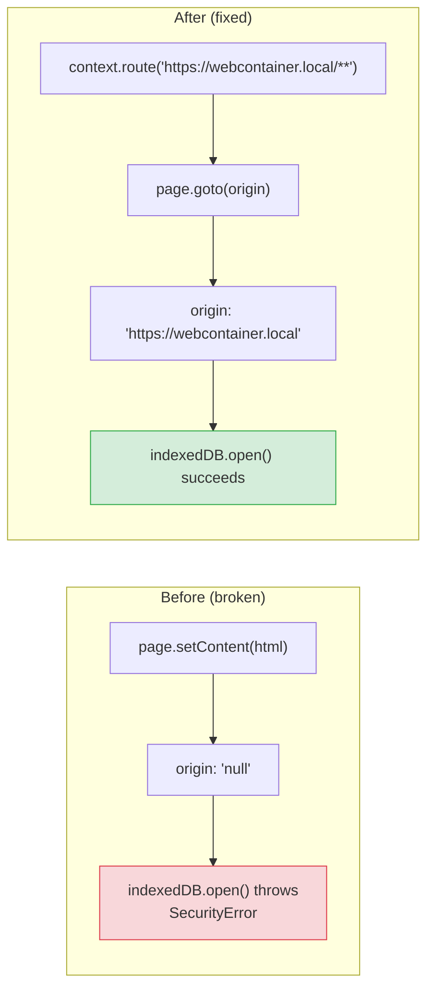
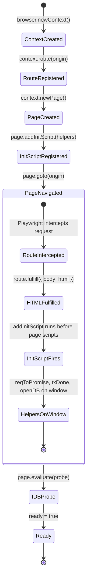
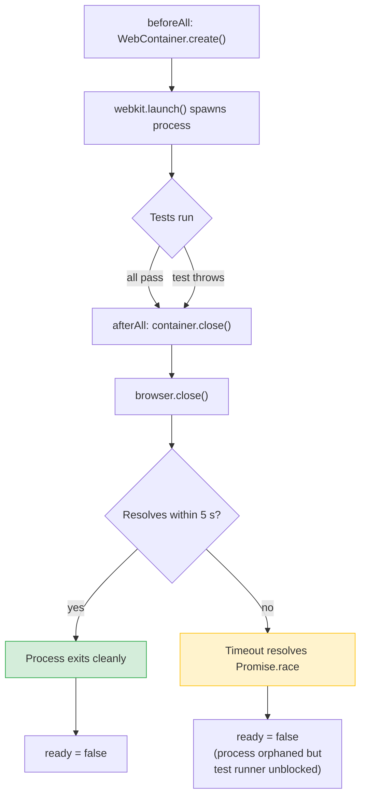
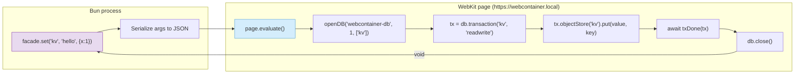

# Testing Architecture

Internal reference for how `idb-repo` tests IndexedDB code outside a browser.

---

## Problem

IndexedDB is a browser-only API. The production code in `src/lib.ts` (`IndexedDbKV`) uses raw `indexedDB.open()`, transactions, cursors, etc. We need a way to exercise this code in CI under `bun test` without a real browser tab.

## Solution: WebContainer

`src/web-container.ts` wraps a headless Playwright WebKit instance. Tests call into the real browser IndexedDB through `page.evaluate()`, getting genuine spec-compliant behavior rather than a polyfill.

```
bun test src/web-container.test.ts
```

---

## High-level flow



---

## Component map



---

## The origin problem and its fix

IndexedDB requires a **secure context** (an origin that is not opaque). The earlier implementation used `page.setContent()` which keeps the page at `about:blank` — origin `"null"`.



The fix uses Playwright's **route interception** to fulfill requests to `https://webcontainer.local` with a minimal HTML shell. The browser sees a real HTTPS origin, so the security context is valid.

### Why not other approaches?

| Approach                         | Problem                                                  |
| -------------------------------- | -------------------------------------------------------- |
| `page.setContent()`              | Stays at `about:blank` — opaque origin                   |
| `data:text/html,...`             | Data URLs also have opaque origins                       |
| `file:///...`                    | `file://` origins are opaque in WebKit                   |
| Spin up an HTTP server           | Unnecessary complexity; port management, startup latency |
| **`context.route()` + `goto()`** | Clean, no real network, proper HTTPS origin              |

---

## Init script injection lifecycle

`addInitScript` vs `evaluate` have different timing. Getting this wrong causes the helpers to be missing when the KV facade runs.



Key ordering constraint: `addInitScript` must be called **before** `page.goto()`. The script fires during navigation, making helpers available for all subsequent `page.evaluate()` calls. The previous code called `addInitScript` _after_ `setContent`, so it only applied to future navigations that never happened — requiring a fragile fallback `evaluate()` block.

---

## Process lifecycle and cleanup

A dangling WebKit process blocks CI runners and leaks memory locally.



### Safeguards

1. **`beforeAll` / `afterAll`** — Container is created once, shared across all `it()` blocks, and closed in `afterAll` regardless of test outcomes.
2. **Timeout race in `close()`** — `Promise.race([browser.close(), timeout(5s)])` prevents a hung WebKit from blocking the test runner indefinitely.
3. **Swallowed errors** — `close()` catches all exceptions so teardown never throws into the test framework.

---

## Data flow through the KV facade

Each facade method (`get`, `set`, `del`) serializes arguments, crosses the Bun-to-WebKit boundary via `page.evaluate()`, runs a full IDB transaction inside the page, and returns the result.



---

## Running tests

```bash
# All tests
bun test

# Just the WebContainer integration tests
bun test src/web-container.test.ts
```
